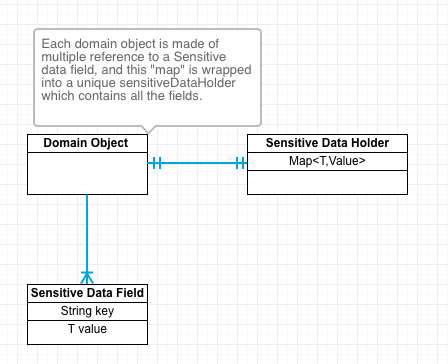
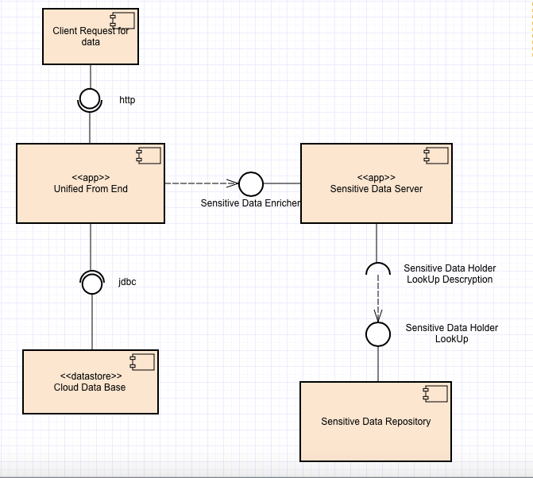
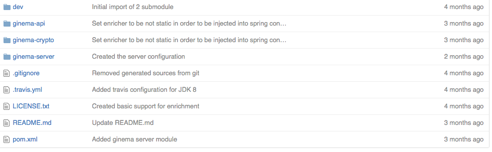

# Ginema  (a framework for managing Sensitive Data)**
<a href="https://travis-ci.org/mccalv/ginema">

</a>

The central ideal behind "Ginema" is to *decouple the sensitive data
from the domain model classes* in order to perform federated search
against different datasets and cloud resources. Sensitive data are
stored in separated hash based structures and serialized using specific
strategies transparent to the domain model.

**In order word, any field of a domain object containing a sensitive
data is replaced with a hash referencing a serialized structure
potentially saved in another system.**

This decoupling allows to store data to the could and sensitive data
locally or in a separated structure and merge them when necessary, or
distribute sensitive data relative to a particular domain object
independently.

**Getting started:**

The framework is based on a declarative approach which consist of
annotating a domain model in the following way:
```java
@SensitiveDataRoot(name = "simpleDomainObject")

public class SimpleDomainObject {

private SensitiveDataID id;

private SensitiveDataField&lt;String&gt; name;

private SensitiveDataField&lt;Date&gt; dateOfBirth;

private SimpleDomainObject child;
```
The framework supports the process of:

-   Serialization:

-   Deserialization

The simplest enrichment supported is the one to extract from an object
its sensitive data fields:
```java
SensitiveDataHolder extract =
SensitiveDataExtractor.extractSensitiveData(object);
```
The opposite operation is to populate an object with sensitive data

SensitiveDataEnricher.enrich(sensitiveDataHolder,object);

Extracting a “*SensitiveDataHolder*” is the process of converting the
sensitive data stored in the domain object into a JSON structure with a
specific schema, which allows also to store all data with relative
types.

The serialization mechanism is based on a data independent Json
Structure used in conjunction with Apache Hadoop and in general in the
Big Data scenario (Apache Avro).

An example of “SensitiveDataHolder” JSON:
```json
{  \
   **"id"**:"71d78c8d-c114-4782-973e-de50002044d6",\
   **"domain"**:"domain",\
   **"dates"**:{  \
      **"411532c8-2225-4405-8318-13cfddc9015e"**:{  \
         **"name"**:"411532c8-2225-4405-8318-13cfddc9015e",\
         **"value"**:1455662605629\
      }\
   },\
   **"strings"**:{  \
      **"411532c8-2225-4405-8318-13cfddc9015e"**:{  \
         **"name"**:"411532c8-2225-4405-8318-13cfddc9015e",\
         **"value"**:"iban account"\
      }\
   },\
   **"longs"**:null,\
   **"integers"**:null,\
   **"floats"**:null,\
   **"doubles"**:null,\
   **"bytes"**:null,\
   **"booleans"**:null\
}
```
While the backing JSON schema can be seen at the URL:

<https://github.com/mccalv/ginema/blob/master/ginema-api/src/main/resources/avro/sensitiveDataHolder.avsc>



Figure Domain Object ER

**Encryption and cloud scenario**

Once the data is decoupled from the domain model, it can be encrypted
and distributed autonomously and stored into different system.

One of the advantages of this approach is the following:

-   Application data can be resident in any cloud while client and
    sensitive data can be stored in a client resident structure
    or similar.

-   Sensitive data can be distributed using a mechanism similar to what
    is used in the mail encryption (PGP)

-   The enricher mechanism can be extended to other language than Java
    since the backing JSON schema is standard.



Figure Sensitive Data Merging on the cloud

**Current status of the Project**



The current maven project, totally hosted on GitHub is made up of 3 sub
modules:

-   Ginema api: core API for enriching and storage

-   Ginema crypto: (Module to support encryption with normal RSA,
    Elliptic curve, PGP)

-   Ginema Server: A rest server to support data sensitive data
    distribution

**Further development**

The current development is aimed to create a sensitive data server which
can expose fast REST API to retrieve sensitive data, but also to search
them using advances queries (Lucene based).

The other stream of work is to support efficient federated research
against sensitive and non sensitive data providing an unified search
interface.

**Technologies:**

Java 1.8

Maven 3.1.1

Spring Boot

https://github.com/mccalv/ginema
